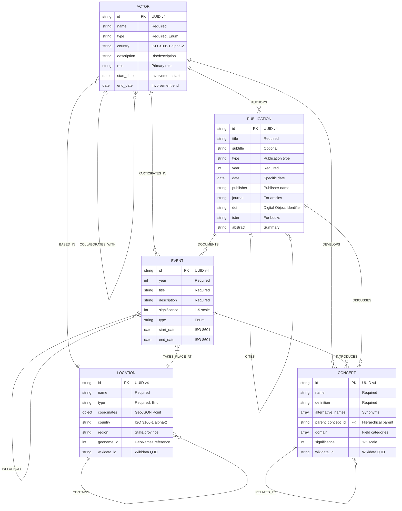

# Planetary Health Knowledge Graph: Entity-Relationship Diagram

This diagram illustrates the entities and relationships in the Planetary Health Knowledge Graph.

## Key Relationship Types

### Event Relationships
- **INFLUENCES**: An event influences another event
- **PRECEDES/FOLLOWS**: Chronological relationship between events
- **TAKES_PLACE_AT**: Event occurs at a location

### Actor Relationships
- **PARTICIPATES_IN**: Actor participates in an event
- **AUTHORS**: Actor authors a publication
- **DEVELOPS**: Actor develops a concept
- **COLLABORATES_WITH**: Actor collaborates with another actor
- **BASED_IN**: Actor is based in a location

### Publication Relationships
- **CITES**: Publication cites another publication
- **DISCUSSES**: Publication discusses a concept
- **DOCUMENTS**: Publication documents an event

### Concept Relationships
- **RELATES_TO**: Concept relates to another concept
- **BUILDS_UPON**: Concept builds upon another concept
- **CONTRADICTS**: Concept contradicts another concept

### Location Relationships
- **CONTAINS**: Location contains another location (e.g., country contains city)
