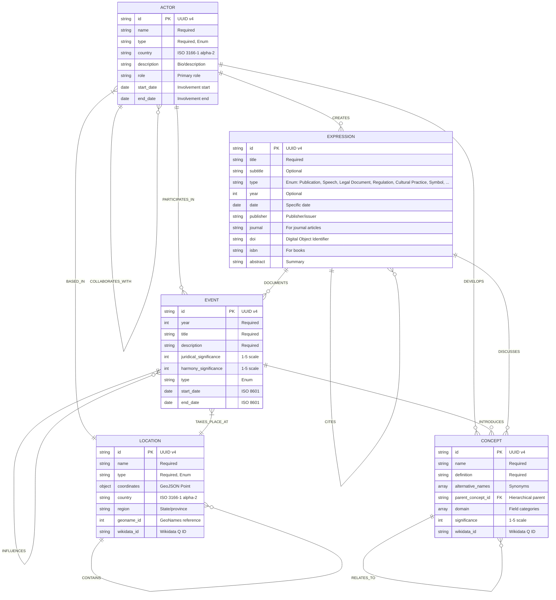

# Planetary Health Knowledge Graph: Entity-Relationship Diagram

This diagram illustrates the entities and relationships in the Planetary Health Knowledge Graph.

```mermaid
erDiagram
    EVENT {
        string id PK "UUID v4"
        int year "Required"
        string title "Required"
        string description "Required"
        int juridical_significance "1-5 scale"
        int harmony_significance "1-5 scale"
        string type "Enum"
        date start_date "ISO 8601"
        date end_date "ISO 8601"
    }
    
    ACTOR {
        string id PK "UUID v4"
        string name "Required"
        string type "Required, Enum"
        string country "ISO 3166-1 alpha-2"
        string description "Bio/description"
        string role "Primary role"
        date start_date "Involvement start"
        date end_date "Involvement end"
    }
    
    LOCATION {
        string id PK "UUID v4"
        string name "Required"
        string type "Required, Enum"
        object coordinates "GeoJSON Point"
        string country "ISO 3166-1 alpha-2"
        string region "State/province"
        int geoname_id "GeoNames reference"
        string wikidata_id "Wikidata Q ID"
    }
    
    CONCEPT {
        string id PK "UUID v4"
        string name "Required"
        string definition "Required"
        array alternative_names "Synonyms"
        string parent_concept_id FK "Hierarchical parent"
        array domain "Field categories"
        int significance "1-5 scale"
        string wikidata_id "Wikidata Q ID"
    }
    
    EXPRESSION {
        string id PK "UUID v4"
        string title "Required"
        string subtitle "Optional"
        string type "Enum: Publication, Speech, Legal Document, Regulation, Cultural Practice, Symbol, ..."
        int year "Optional"
        date date "Specific date"
        string publisher "Publisher/issuer"
        string journal "For journal articles"
        string doi "Digital Object Identifier"
        string isbn "For books"
        string abstract "Summary"
    }
    
    ACTOR ||--o{ EVENT : "PARTICIPATES_IN"
    ACTOR ||--o{ EXPRESSION : "CREATES"
    ACTOR ||--o{ CONCEPT : "DEVELOPS"
    ACTOR ||--o{ ACTOR : "COLLABORATES_WITH"
    ACTOR }|--|| LOCATION : "BASED_IN"
    
    EVENT ||--o{ EVENT : "INFLUENCES"
    EVENT }|--|| LOCATION : "TAKES_PLACE_AT"
    EVENT ||--o{ CONCEPT : "INTRODUCES"
    
    EXPRESSION ||--o{ EXPRESSION : "CITES"
    EXPRESSION ||--o{ CONCEPT : "DISCUSSES"
    EXPRESSION ||--o{ EVENT : "DOCUMENTS"
    
    CONCEPT ||--o{ CONCEPT : "RELATES_TO"
    
    LOCATION ||--o{ LOCATION : "CONTAINS"
```

## Key Relationship Types

### Event Relationships
- **INFLUENCES**: An event influences another event
- **PRECEDES/FOLLOWS**: Chronological relationship between events
- **TAKES_PLACE_AT**: Event occurs at a location
- **INTRODUCES**: Event introduces a concept

### Actor Relationships
- **PARTICIPATES_IN**: Actor participates in an event
- **CREATES**: Actor creates an expression (authors, delivers, enacts, etc.)
- **DEVELOPS**: Actor develops a concept
- **COLLABORATES_WITH**: Actor collaborates with another actor
- **BASED_IN**: Actor is based in a location

### Expression Relationships
- **CITES**: Expression cites another expression
- **DISCUSSES**: Expression discusses a concept
- **DOCUMENTS**: Expression documents an event

### Concept Relationships
- **RELATES_TO**: Concept relates to another concept
- **BUILDS_UPON**: Concept builds upon another concept
- **CONTRADICTS**: Concept contradicts another concept

### Location Relationships
- **CONTAINS**: Location contains another location (e.g., country contains city)

## Notes on Expression Types

The `EXPRESSION` entity covers a broad range of communicative artifacts:

| Type | Description |
|------|-------------|
| Publication | Generic published work |
| Journal Article | Peer-reviewed academic article |
| Book | Monograph or edited volume |
| Book Chapter | Chapter in an edited volume |
| Conference Paper | Paper presented at a conference |
| Report | Institutional or policy report |
| Policy Brief | Short policy-focused document |
| White Paper | Authoritative report or guide |
| Thesis | Doctoral or master's thesis |
| Speech | Delivered address or lecture |
| Legal Document | Treaty, charter, declaration, court ruling |
| Regulation | Law, directive, or regulatory act |
| Cultural Practice | Ongoing cultural or traditional practice |
| Symbol | Symbol, emblem, or cultural marker |
| Other | Any expression not covered above |

## Notes on Event Significance

Events carry two significance dimensions rather than a single score:

| Field | Description |
|-------|-------------|
| `juridical significance` | Importance for recognizing the rights of nature (1–5) |
| `harmony significance` | Importance for living in harmony with nature (1–5) |
